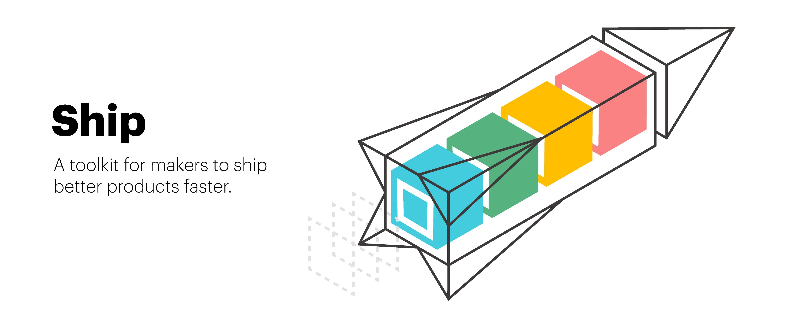

[](LICENSE)
[](http://makeapullrequest.com)

[](https://github.com/paralect/ship/watchers)
[](https://github.com/paralect/ship/stargazers)
[](https://twitter.com/paralect)
[](https://twitter.com/intent/tweet?text=I%27m%20building%20my%20next%20product%20with%20Ship%20%F0%9F%9A%80.%20Check%20it%20out:%20https://github.com/paralect/ship)

A toolkit for makers to ship better products faster 🚀. 

[Ship](https://github.com/paralect/ship) is a tool that helps create new products faster. Ship is based on several open-source components, resulting from years of hard work [Paralect](https://www.paralect.com) team. We carefully select, document, and share our production-ready knowledge with you.

We encourage developers to share production-ready solutions and help to business ship something people need as quick as possible.

## Getting started

```shell
npx create-ship-app init
```

## Why Ship?

Shipping is crucial part of any new product. The quicker you ship, the more time you have to validate your hypotheses. The quicker you validate your idea, the sooner you know if you're building what people want.

In the rush, developers often ignore quality. Backups, monitoring, proper data validation and many other things seems not so important in the beginning. Sometimes you're lucky, sometimes not.

We believe we could ship great products faster, while maintain decent quality and have a plan for scaling when hypotheses where right.

## Core concepts

* We automatically build ship out of the number of smaller components. Our ultimate goal is too keep only parts your need for your product development.
* Every component is kept is tiny as possible to simplify maintenance and stay up to date with new releases. 
* Ship is always in a production-ready state. We test every release manually to make sure great developer experience. We use ship to build our products, see more [here](https://www.paralect.com/build-stage).

## Ship components

|Name|Description|
|:---|:----------|
|[Koa.JS REST api](https://github.com/paralect/koa-api-starter)|REST api|
|[Next.JS web app](https://github.com/paralect/next-starter)|Next.JS application|
|[MongoDB api for Node.JS](https://github.com/paralect/node-mongo)|Reactive 🚀 extension to MongoDB API|
|[Deploy (k8s and GitHub Actions)](https://github.com/paralect/ship-deploy)|Deploy scripts for Kubernetes|

## License

Ship is released under the [MIT License](LICENSE).

## Contributing

Join us and share something developers need 👌.
