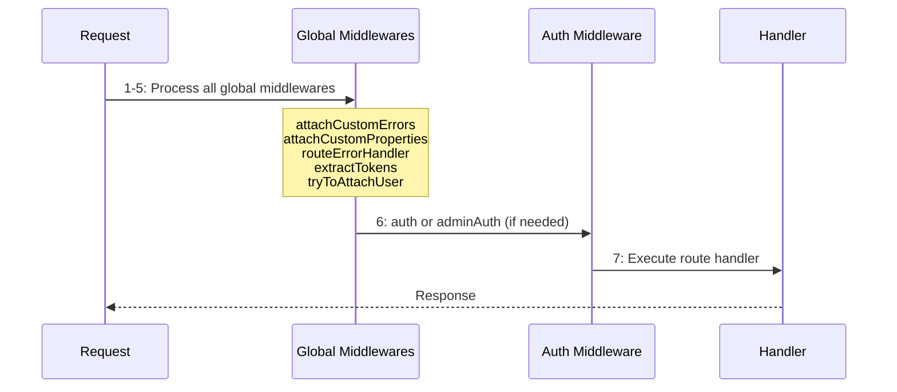

## Overview

Ship uses middlewares for authentication, error handling, and request processing. Middlewares are applied in two ways:

- **Global Middlewares** — Run for all routes in a specific order
- **Route-Specific Middlewares** — Applied only to private or admin routes

## Execution Order



## Global Middlewares

### 1. attachCustomErrors

Adds custom error handling methods to the context (`ctx`).

**Available methods:**

```typescript
// Throw simple error
ctx.throwError('User not found', 404);

// Conditional error
ctx.assertError(user.isActive, 'User account is disabled', 403);

// Field-level validation errors
ctx.throwClientError({
  email: 'Email is required',
  password: 'Password must be at least 8 characters'
});

// Conditional client error
ctx.assertClientError(!existingUser, { email: 'Email already exists' });

// Redirect with error message
ctx.throwGlobalErrorWithRedirect('Authentication failed', 'https://example.com/login');
```

### 2. attachCustomProperties

Initializes `ctx.validatedData = {}` which is later populated by the [validate middleware](/api-reference/middlewares#validate-middleware).

### 3. routeErrorHandler

Catches and formats errors from route handlers. Logs errors with request context and hides sensitive details in production.

**Error response format:**

```json
{
  "errors": {
    "email": ["Email is required"],
    "password": ["Password must be at least 8 characters"]
  }
}
```

### 4. extractTokens

Extracts access tokens from requests and stores in `ctx.state.accessToken`.

**Token sources (checked in order):**
1. `ACCESS_TOKEN` cookie
2. `Authorization: Bearer <token>` header

### 5. tryToAttachUser

Validates the access token and attaches the user to `ctx.state.user` if valid. Also updates the user's last request timestamp.

<Note>
This middleware doesn't block requests if the token is invalid. Use the `auth` middleware to enforce authentication.
</Note>

## Route-Specific Middlewares

Applied to specific route types for authentication and authorization.

### auth

Ensures user is authenticated by checking if `ctx.state.user` exists. Returns `401` if not authenticated.

**Usage:**

```typescript
app.use(mount('/account', compose([auth, accountRoutes.privateRoutes])));
```

### adminAuth

Validates admin access by checking the `x-admin-key` header against the `ADMIN_KEY` environment variable. Returns `401` if invalid.

**Usage:**

```typescript
app.use(mount('/admin/users', compose([adminAuth, userRoutes.adminRoutes])));
```

**Making admin requests:**

```bash
curl -X GET https://api.example.com/admin/users \
  -H "x-admin-key: your-admin-key-here"
```

## Summary

**Execution order:**
1. `attachCustomErrors` - Adds error methods
2. `attachCustomProperties` - Initializes properties
3. `routeErrorHandler` - Wraps in error handler
4. `extractTokens` - Extracts token from cookie/header
5. `tryToAttachUser` - Validates token, attaches user
6. `auth` or `adminAuth` (if applicable)
7. Route handler

## See Also

- [Routing](/api-reference/routing/overview) - Routing architecture overview
- [Middlewares](/api-reference/middlewares) - Validation and rate limiting
- [API Actions](/api-reference/api-action) - Creating resource endpoints

