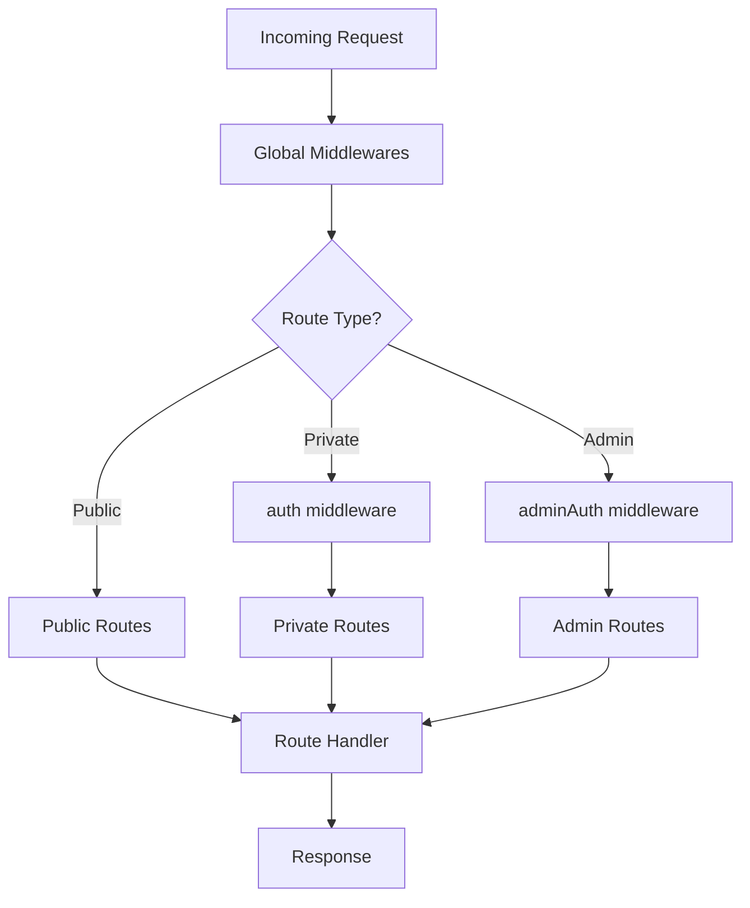
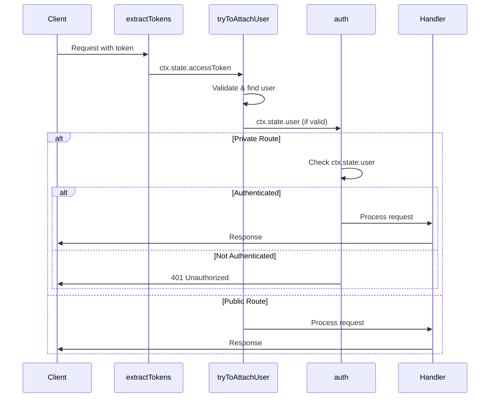

Ship's API routing system is built on [Koa](https://koajs.com/) and organizes routes into three categories: **public**, **private**, and **admin** routes. All routes pass through global middlewares before reaching their handlers.

## Request Flow



## Route Definition

Routes are defined in `/api/src/routes/index.ts`:

```typescript /api/src/routes/index.ts
const defineRoutes = (app: AppKoa) => {
  // Global middlewares (applied to all routes)
  app.use(attachCustomErrors);
  app.use(attachCustomProperties);
  app.use(routeErrorHandler);
  app.use(extractTokens);
  app.use(tryToAttachUser);

  // Route registration
  publicRoutes(app);
  privateRoutes(app);
  adminRoutes(app);
};
```

Global middlewares run for every request. See [Routing Middlewares](/api-reference/routing/middlewares) for details.

## Route Types

### Public Routes

Accessible without authentication. Defined in `/api/src/routes/public.routes.ts`.

**Examples:**
- `GET /health` - Health check
- `POST /account/sign-up` - User registration
- `POST /account/sign-in` - User authentication

### Private Routes

Require user authentication via the `auth` middleware. Defined in `/api/src/routes/private.routes.ts`.

```typescript
// Private routes use auth middleware
app.use(mount('/account', compose([auth, accountRoutes.privateRoutes])));
```

**Examples:**
- `GET /account` - Get current user account
- `PUT /account` - Update user profile
- `GET /users` - List users

### Admin Routes

Require admin authentication via the `adminAuth` middleware (validates `x-admin-key` header). Defined in `/api/src/routes/admin.routes.ts`.

```typescript
// Admin routes use adminAuth middleware
app.use(mount('/admin/users', compose([adminAuth, userRoutes.adminRoutes])));
```

**Examples:**
- `GET /admin/users` - Admin user management
- `PUT /admin/users/:id` - Admin user updates

## Route Mounting

Ship uses two Koa utilities:

- **koa-mount** - Mount routes at a specific path prefix
- **koa-compose** - Compose multiple middlewares together

```typescript
// Mount routes with prefix
app.use(mount('/account', accountRoutes.publicRoutes));

// Compose auth middleware with routes
app.use(mount('/account', compose([auth, accountRoutes.privateRoutes])));
```

## Authentication Flow



## See Also

- [Routing Middlewares](/api-reference/routing/middlewares) - Global and route-specific middlewares
- [API Actions](/api-reference/api-action) - Creating resource endpoints
- [Middlewares](/api-reference/middlewares) - Validation and rate limiting

