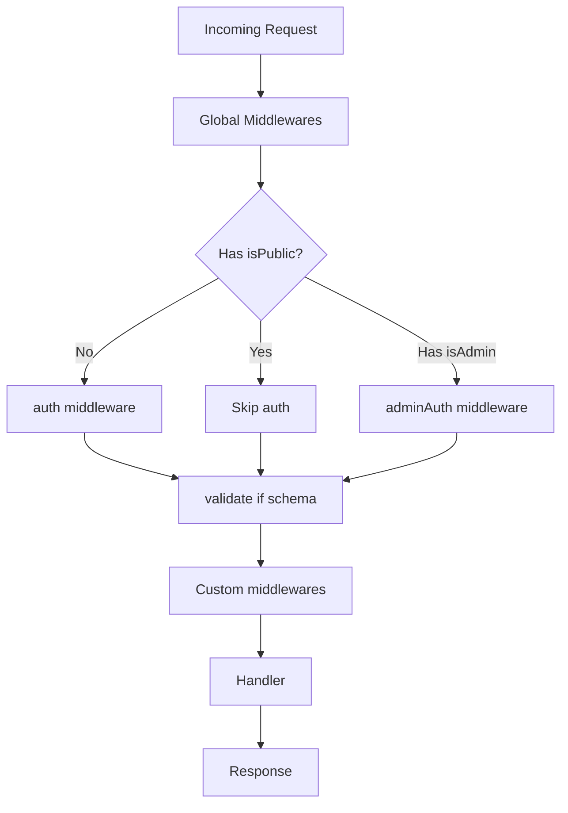
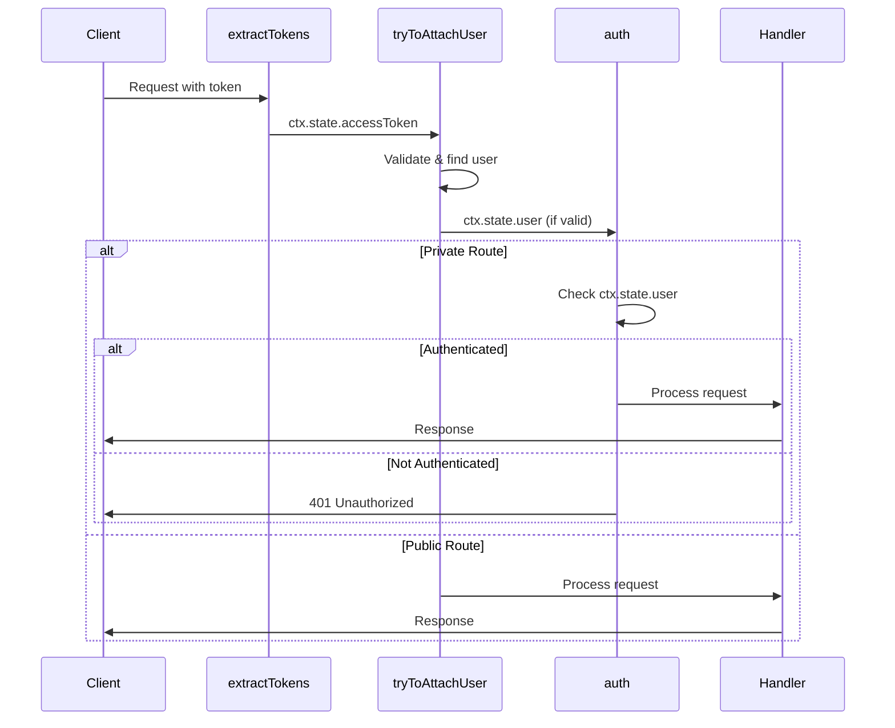

Ship's API routing system is built on [Koa](https://koajs.com/) with **automatic route discovery**. Endpoints are auto-registered from `resources/<name>/endpoints/` — no manual route files needed. All routes pass through global middlewares before reaching their handlers.

## Request Flow


```mermaid
flowchart TD
    A[Incoming Request] --> B[Global Middlewares]
    B --> C{Has isPublic?}
    C -->|Yes| D[Skip auth]
    C -->|No| E[auth middleware]
    C -->|Has isAdmin| F[adminAuth middleware]
    E --> G[validate if schema]
    D --> G
    F --> G
    G --> H[Custom middlewares]
    H --> I[Handler]
    I --> J[Response]
```

## Auto-Discovery

Routes register automatically. Each file in `resources/<name>/endpoints/` that default-exports `createEndpoint({...})` is mounted at `/<name>/<path>`.

```typescript resources/projects/endpoints/list.ts
import createEndpoint from 'routes/createEndpoint';

export default createEndpoint({
  method: 'get',
  path: '/',

  async handler(ctx) {
    // GET /projects/
    return { projects: [] };
  },
});
```

- **Resource name = URL prefix**: `resources/projects/` → `/projects/*`
- **No manual registration** — just place files in `endpoints/`
- Check startup logs for: `[routes] METHOD /resource/path`

## Auth Default

Every endpoint requires authentication **unless** `isPublic` is in the `middlewares` array. `isPublic` is a sentinel reference — the route system checks `middleware === isPublic` by identity.

```typescript
import createEndpoint from 'routes/createEndpoint';
import isPublic from 'middlewares/isPublic';

export default createEndpoint({
  method: 'post',
  path: '/sign-up',
  schema,
  middlewares: [isPublic],

  async handler(ctx) {
    // accessible without auth
  },
});
```

For admin endpoints, use `isAdmin` middleware which checks the `x-admin-key` header against `config.ADMIN_KEY`.

## Authentication Flow


```mermaid
sequenceDiagram
    participant Client
    participant extractTokens
    participant tryToAttachUser
    participant auth
    participant Handler

    Client->>extractTokens: Request with token
    extractTokens->>tryToAttachUser: ctx.state.accessToken
    tryToAttachUser->>tryToAttachUser: Validate & find user
    tryToAttachUser->>auth: ctx.state.user (if valid)
    
    alt Private Route
        auth->>auth: Check ctx.state.user
        alt Authenticated
            auth->>Handler: Process request
            Handler->>Client: Response
        else Not Authenticated
            auth->>Client: 401 Unauthorized
        end
    else Public Route
        tryToAttachUser->>Handler: Process request
        Handler->>Client: Response
    end
```

## See Also

- [Routing Middlewares](/api-reference/routing/middlewares) - Global and route-specific middlewares
- [API Actions](/api-reference/api-action) - Creating resource endpoints
- [Middlewares](/api-reference/middlewares) - Validation and rate limiting

