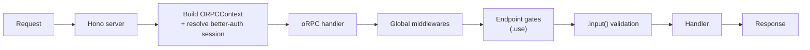

Ship has no route registry. You drop an endpoint file into a resource, and codegen mounts it. The route table *is* the directory tree — standardised patterns, zero guesswork.

## Endpoints mount by file path

Each file under `apps/api/src/resources/<name>/endpoints/` is one endpoint. Its method and HTTP path come from the file name and folder structure:

| File | Method | Path |
| --- | --- | --- |
| `users/endpoints/list.ts` | `GET` | `/users` |
| `users/endpoints/create.ts` | `POST` | `/users` |
| `users/endpoints/[userId]/update.ts` | `PUT` | `/users/{userId}` |
| `users/endpoints/[userId]/delete.ts` | `DELETE` | `/users/{userId}` |
| `users/endpoints/current.get.ts` | `GET` | `/users/current` |
| `users/endpoints/dev-verify-email.post.ts` | `POST` | `/users/dev-verify-email` |

The conventions, from `scripts/codegen-router.ts`:

- **CRUD names** — `list` → `GET` (collection), `create` → `POST` (collection), `get` → `GET`, `update` → `PUT`, `delete` → `DELETE`.
- **Method suffix** — `name.post.ts` → `POST /name`, `status.get.ts` → `GET /status`. Use this for non-CRUD actions.
- **`[param]` folders** — `[userId]/` becomes the `{userId}` dynamic segment.
- **Resource name = path prefix** — `resources/users/` → `/users/*`.

An endpoint that needs a non-default route declares it inline with `.route(...)`, which overrides the convention:

```ts
export default endpoint
  .use(isAuthorized)
  .route({ method: 'DELETE', path: '/notes/{id}' })
  .input(z.object({ id: z.string() }))
  .use(canEditNote)
  .output(z.void())
  .handler(async ({ input }) => {
    await db.notes.deleteOne({ id: input.id });
  });
```

## Contract-first, generated

oRPC splits a thin **contract** (routes + schemas) from the **router** (implementations). Ship generates both from the filesystem, so the wiring is always real:

```bash
pnpm --filter api codegen
```

`codegen-router.ts` discovers every resource and endpoint, then writes two files. **Both are generated — never edit them by hand.**

`src/contract.ts` carries one route per endpoint:

```ts contract.ts
// Auto-generated by codegen-router.ts — do not edit manually
import { oc } from '@orpc/contract';

export const contract = oc.router({
  users: oc.router({
    delete: oc.route({ method: 'DELETE', path: '/users/{userId}' }),
    update: oc.route({ method: 'PUT', path: '/users/{userId}' }),
    getCurrent: oc.route({ method: 'GET', path: '/users/current' }),
    list: oc.route({ method: 'GET', path: '/users' }),
  }),
});
```

`src/router.ts` implements that contract by slotting each endpoint into place, and exports the `AppClient` type the web app imports:

```ts router.ts
// Auto-generated by codegen-router.ts — do not edit manually
import { implement } from '@orpc/server';

import usersUserIdUpdate from './resources/users/endpoints/[userId]/update';
import usersList from './resources/users/endpoints/list';
import { contract } from './contract';

export const router = implement(contract)
  .$context<ORPCContext>()
  .router({
    users: {
      update: usersUserIdUpdate,
      list: usersList,
    },
  });

export type AppClient = RouterClient<Router>;
```

Codegen also imports each resource's `handlers/*` (so [mutation-event](/how-ship-works) side effects register) and emits a parallel spec-only router that feeds the [Scalar](/api-reference/overview) docs. Run it after adding or removing an endpoint file — `pnpm --filter api dev` runs it in `--watch` mode for you.

## Request flow


```mermaid
flowchart LR
  REQ[Request] --> HONO[Hono server]
  HONO --> CTX["Build ORPCContext\n+ resolve better-auth session"]
  CTX --> ORPC[oRPC handler]
  ORPC --> GLOBAL[Global middlewares]
  GLOBAL --> GATES["Endpoint gates\n(.use)"]
  GATES --> VAL[".input() validation"]
  VAL --> H[Handler]
  H --> RES[Response]
```

`server.ts` builds an `ORPCContext` for each request — cookies, headers, and the better-auth session resolved into `context.user`. The oRPC handler then runs the endpoint's [global middlewares](/api-reference/middlewares), its [gates](/api-reference/routing/middlewares), and `.input()` validation before the handler.

## Session context

Auth is contextual, not a route flag. `serverConfig.resolveUser` reads the better-auth session from the request headers and attaches the user row to `context.user` when present:

```ts server-config.ts
const session = await auth.api.getSession({ headers: ctx.rawRequest.headers });
if (session?.user) {
  ctx.user = await db.users.findFirst({ where: { id: session.user.id } });
}
```

Endpoints stay unauthenticated until you stack a gate. Add `.use(isAuthorized)` to require a signed-in `context.user`; add `.use(isAdmin)` to require an admin. See [Middlewares](/api-reference/routing/middlewares).

## See also

- [Middlewares](/api-reference/routing/middlewares) — global and per-endpoint gate composition
- [API overview](/api-reference/overview) — the full Hono + oRPC story
- [How Ship works](/how-ship-works) — the resource-owns-everything model
