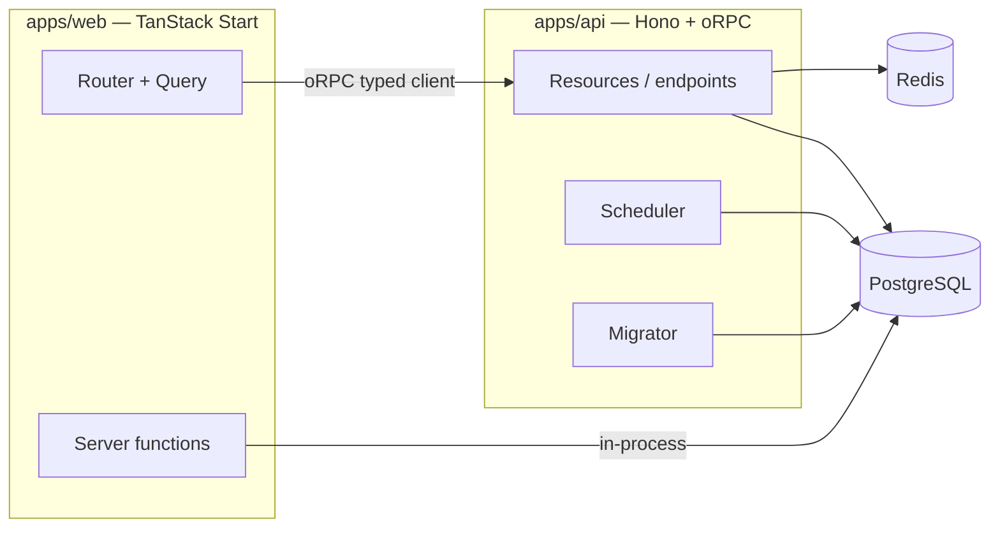

## Overview

Ship is a [pnpm](https://pnpm.io/) + [Turborepo](https://turbo.build/repo/docs) monorepo built on a focused, modern TypeScript stack.

| Layer | Stack |
| --- | --- |
| **Web** (`apps/web`) | [TanStack Start](https://tanstack.com/start) (SPA) · [TanStack Router](https://tanstack.com/router) · [TanStack Query](https://tanstack.com/query) · [shadcn/ui](https://ui.shadcn.com/) · [Tailwind v4](https://tailwindcss.com/) |
| **API** (`apps/api`) | [Hono](https://hono.dev/) · [oRPC](https://orpc.unnoq.com/) · [Drizzle ORM](https://orm.drizzle.team/) · [PostgreSQL](https://www.postgresql.org/) · [better-auth](https://better-auth.com/) · [Socket.IO](https://socket.io/) |
| **Tooling** | [Turborepo](https://turbo.build/repo/docs) · [pnpm](https://pnpm.io/) · [Docker](https://www.docker.com/) · [drizzle-kit](https://orm.drizzle.team/kit-docs/overview) · [TypeScript](https://www.typescriptlang.org/) |

On a high level Ship consists of these parts:

<CardGroup cols={3}>
  <Card title="Web" icon="browser" href="/web/overview" />
  <Card title="API" icon="square-terminal" href="/api-reference/overview" />
  <Card title="Plugins" icon="puzzle-piece" href="/plugins/overview" />
  <Card title="Scheduler" icon="calendar" href="/scheduler" />
  <Card title="Migrator" icon="truck-moving" href="/migrator" />
  <Card title="Deployment" icon="upload" href="/deployment/digital-ocean-apps" />
</CardGroup>



## Two shapes

Both options share the same `apps/web` base (a landing page + an example server function). They differ in whether an API app exists:

- **PostgreSQL + TanStack Start** — full-stack. `apps/web` talks to `apps/api` through a fully typed oRPC client. Add the **Auth** plugin and the web app gains sign-in/up, the authenticated app shell, and the client wiring.
- **TanStack Start web-only** — no `apps/api`. Backend logic runs as [server functions](/web/server-functions) inside the Start server. No database or auth unless you add them.

## End-to-end type safety

Types flow from the API to the web app **through TypeScript declarations — no codegen, no shared types package**:

1. An endpoint declares `.input(zodSchema).output(zodSchema).handler(...)`.
2. `pnpm --filter api build:types` emits `.d.ts` files.
3. The web app depends on `"api": "workspace:*"` and imports `import type { AppClient } from 'api'`.

Within the API, three codegen scripts keep the wiring in sync with the filesystem:

| Script | Generates | Run after |
| --- | --- | --- |
| `scripts/codegen-router.ts` | `src/router.ts` + `src/contract.ts` | adding/removing an endpoint file |
| `scripts/codegen-db.ts` | `src/db.ts` (typed `DbService` per table) | adding/removing a schema file |

See [How Ship works](/how-ship-works) for the resource-owns-everything model behind this.

## Dev dashboards

A running full-stack project exposes two local dashboards:

- **API reference** — a [Scalar](https://scalar.com/) UI at [http://localhost:3001/docs](http://localhost:3001/docs) (raw OpenAPI 3.1 at `/spec.json`), served in-process by Hono in non-production.
- **Database browser** — [Drizzle Studio](https://orm.drizzle.team/drizzle-studio/overview) at [https://local.drizzle.studio](https://local.drizzle.studio), started with `pnpm dashboard`.

## Running the app

```bash
pnpm start        # infra → migrate → scheduler → api + web
pnpm turbo-start  # dev via Turborepo (assumes infra already running)
```

Run infrastructure (PostgreSQL + Redis) on its own with `pnpm infra`, or individual services with `pnpm --filter api dev` / `pnpm --filter web dev`.
