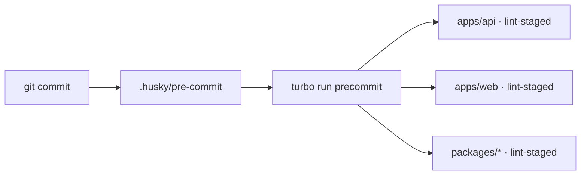

Ship runs lint and format checks before every commit so the codebase stays consistent — for you and for your agents. The wiring is [Husky](https://typicode.github.io/husky/) → [Turborepo](https://turbo.build/repo/docs) → [lint-staged](https://github.com/lint-staged/lint-staged).

## How it works

A Husky `pre-commit` hook runs Turborepo's `precommit` task across the monorepo. Each package's `precommit` script is `lint-staged`, which applies that package's linters and formatters.



The hook itself is tiny — `template/.husky/pre-commit`:

```bash
cd template
pnpm exec turbo run precommit --concurrency=1
```

<Info>
  The hook is installed automatically. `template/package.json` has a `prepare` script (`cd .. && husky template/.husky`) that runs on `pnpm install`.
</Info>

## Configuration

`lint-staged` lives in each package's `package.json` under a `lint-staged` key, and `precommit` is just `"precommit": "lint-staged"`.

### API — `apps/api/package.json`

```json
"lint-staged": {
  "*.ts": [
    "eslint . --fix",
    "bash -c 'tsc --noEmit'",
    "prettier . --write"
  ],
  "*.{json,md}": [
    "prettier --write"
  ]
}
```

When a `.ts` file is staged, the API runs ESLint with `--fix`, a project-wide `tsc --noEmit` type check, and Prettier across the package (the trailing `.` means whole-project, not only staged files — so a bypassed `--no-verify` commit gets cleaned up on the next one).

### Web — `apps/web/package.json`

```json
"lint-staged": {
  "*.{ts,tsx}": [
    "eslint --fix",
    "prettier --write"
  ],
  "*.css": [
    "prettier --write"
  ],
  "*.{json,md}": [
    "prettier --write"
  ]
}
```

The web app lints and formats the staged files only (no trailing `.`), and there's no `tsc` step in the hook — type errors surface in the editor and in CI instead. See [GitHub Actions](/github-actions).

### Packages

Shared packages carry their own `lint-staged`. For example `template/packages/app-constants/package.json`:

```json
"lint-staged": {
  "*.ts": [
    "eslint . --fix",
    "bash -c 'tsc --noEmit'",
    "prettier . --write"
  ],
  "*.{json,md}": [
    "prettier . --write"
  ]
}
```

The other shared packages — `@ship/db`, `@ship/emails`, `@ship/cloud-storage`, `eslint-config`, `prettier-config`, `tsconfig` — are checked through the same Turborepo `precommit` task.

## Customization

### Change the linters

Edit the `lint-staged` block in the relevant `package.json`:

```json
"lint-staged": {
  "*.ts": [
    "eslint . --fix",
    "prettier . --write"
  ]
}
```

A trailing `.` runs the tool on the whole package; omit it to act on staged files only.

```json
"lint-staged": {
  "*.ts": [
    "eslint --fix",
    "prettier --write"
  ]
}
```

<Warning>
  Linting only staged files means problems elsewhere (for instance from a `--no-verify` commit) won't be caught until those files change again.
</Warning>

### Skip the hook

```bash
git commit --no-verify -m "message"
```

<Tip>
  Skip only when you truly must — the hook is what keeps the build green for everyone else.
</Tip>

## Troubleshooting

**Hook not running?**

1. Reinstall to re-run `prepare`:
   ```bash
   pnpm install
   ```
2. Check that `template/.husky/pre-commit` exists.
3. Confirm Git's hooks path:
   ```bash
   git config core.hooksPath
   ```

**Linter blocking the commit?** Read the output, let `--fix` resolve what it can, `git add` the changes, and commit again.
