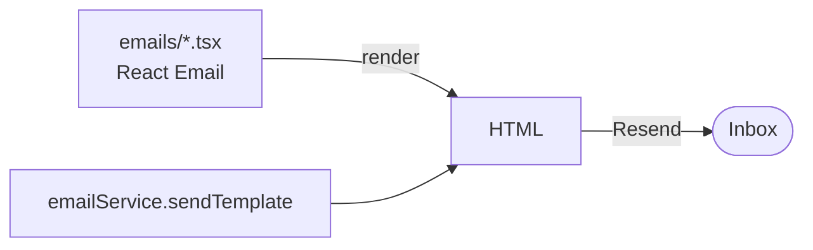

The **Mailer** plugin gives you transactional email with full type safety: write templates as [React Email](https://react.email/) components, send them through [Resend](https://resend.com/), and call one typed `sendTemplate` method from anywhere in the API.

It's a plugin — installing it merges the `@ship/emails` package (`packages/emails`) into your repo, so every template and the service itself are yours to edit.



## The package

`@ship/emails` exports a single `emailService` plus the template types:

```ts packages/emails/src/index.ts
export * from './template';
export * from './utils';
export { default as emailService } from './email.service';
```

Templates and their props are registered in `template.ts` — a `Template` union, the `EmailComponent` map, and a `TemplateProps` map that ties each template to its prop type:

```ts packages/emails/src/template.ts
import { ResetPassword, ResetPasswordProps } from '../emails/reset-password';
import { SignUpWelcome, SignUpWelcomeProps } from '../emails/sign-up-welcome';
import { VerifyEmail, VerifyEmailProps } from '../emails/verify-email';

export type Template = 'reset-password' | 'sign-up-welcome' | 'verify-email';

export const EmailComponent = {
  'reset-password': ResetPassword,
  'sign-up-welcome': SignUpWelcome,
  'verify-email': VerifyEmail,
};

export interface TemplateProps {
  'reset-password': ResetPasswordProps;
  'sign-up-welcome': SignUpWelcomeProps;
  'verify-email': VerifyEmailProps;
}
```

This is what makes the API end type-safe: pick `template: 'verify-email'` and TypeScript requires exactly `VerifyEmailProps`.

## Sending email

Import `emailService` and call `sendTemplate`. The `params` are checked against the chosen template's props:

```ts apps/api/src/auth.ts
import { emailService } from '@ship/emails';

await emailService.sendTemplate({
  to: user.email,
  subject: 'Please Confirm Your Email Address for Ship',
  template: 'verify-email',
  params: {
    name: user.name,
    href: url,
  },
});
```

Under the hood `sendTemplate` renders the React component to HTML and hands it to Resend:

```ts packages/emails/src/email.service.ts
async sendTemplate<T extends Template>({ to, subject, template, params, attachments }: SendTemplateParams<T>) {
  if (!this.resend) {
    console.error('[Resend] API key is not provided');
    return null;
  }

  const html = await renderEmailHtml({ template, params });

  return this.resend.emails.send({
    from: `${this.from.name} <${this.from.email}>`,
    to,
    subject,
    html,
    attachments,
  });
}
```

<Note>
With no `RESEND_API_KEY`, `sendTemplate` logs the email payload and returns `null` instead of sending — so local development and tests never hit Resend.
</Note>

## Configuration

The service is constructed from environment variables, with sensible fallbacks for the sender:

```ts packages/emails/src/email.service.ts
export default new EmailService({
  apiKey: process.env.RESEND_API_KEY,
  from: {
    email: process.env.RESEND_FROM_EMAIL || 'no-reply@ship.paralect.com',
    name: process.env.RESEND_FROM_NAME || 'Ship',
  },
});
```

| Variable | Purpose |
| --- | --- |
| `RESEND_API_KEY` | Resend API key. Unset → emails are logged, not sent |
| `RESEND_FROM_EMAIL` | Sender address (default `no-reply@ship.paralect.com`) |
| `RESEND_FROM_NAME` | Sender display name (default `Ship`) |

## Writing a template

A template is a React Email component plus an exported props interface. It composes the shared `Layout` and `_components`:

```tsx packages/emails/emails/sign-up-welcome.tsx
import React, { FC } from 'react';
import { Text } from '@react-email/components';

import Button from './_components/button';
import Layout from './_layout';

export interface SignUpWelcomeProps {
  name: string;
  href: string;
}

export const SignUpWelcome: FC<SignUpWelcomeProps> = ({ name = 'John', href = 'https://ship.paralect.com' }) => (
  <Layout previewText="Welcome on board the Ship!">
    <Text>Dear {name},</Text>
    <Text>We are excited to have you join our growing Ship community.</Text>
    <Button href={href}>Get Started</Button>
  </Layout>
);

export default SignUpWelcome;
```

To add one:

<Steps>
  <Step title="Create the component">
    Add `emails/<name>.tsx`, exporting the component and its `Props` interface.
  </Step>
  <Step title="Register it">
    In `src/template.ts`, add the name to the `Template` union, the `EmailComponent` map, and `TemplateProps`.
  </Step>
  <Step title="Send it">
    `emailService.sendTemplate({ template: '<name>', params: { ... } })` — typed end to end.
  </Step>
</Steps>

## Local preview

React Email ships a live preview server. Run it to see your templates in the browser with hot reload:

```bash
pnpm --filter @ship/emails dev
```

This serves the `emails/` folder at [http://localhost:4000](http://localhost:4000). Default prop values (like `name = 'John'`) render so every template has realistic content without wiring up data.


<Tip>
Preview renders straight from the React components, so what you see is exactly what `sendTemplate` produces — no separate build step.
</Tip>
