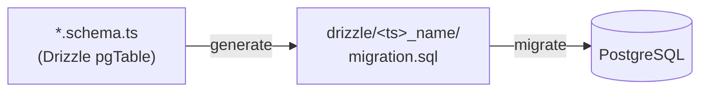

Your schema is the source of truth. You edit a Drizzle `pgTable`, Ship turns the diff into a versioned SQL migration, and the migrator applies it before anything else ships. No hand-written DDL, no drift between your types and your database.

Migrations are powered by [drizzle-kit](https://orm.drizzle.team/kit-docs/overview) and applied by a small standalone script (`apps/api/scripts/migrate.ts`) that runs as its own service — so a long-running migration never blocks the API.

## The flow

<Steps>
  <Step title="Edit the schema">
    Change the Drizzle table in `resources/<name>/<name>.schema.ts`.
  </Step>
  <Step title="Generate SQL">
    `pnpm --filter api generate` diffs your schema against the last snapshot and writes a timestamped migration into `apps/api/drizzle/`.
  </Step>
  <Step title="Review">
    Read the generated `.sql`. It's plain SQL — commit it like any other code.
  </Step>
  <Step title="Apply">
    `pnpm --filter api migrate` runs every pending migration in order.
  </Step>
</Steps>



## Configuration

drizzle-kit reads `apps/api/drizzle.config.ts`. It picks up every schema file by glob and writes migrations to `./drizzle`:

```ts apps/api/drizzle.config.ts
import { defineConfig } from 'drizzle-kit';
import process from 'node:process';

export default defineConfig({
  dialect: 'postgresql',
  casing: 'snake_case',
  schema: './src/resources/*/*.schema.ts',
  out: './drizzle',
  dbCredentials: {
    url: process.env.DATABASE_URL!,
  },
});
```

Because the glob is `resources/*/*.schema.ts`, any new resource schema is picked up automatically — there's no central registry to update.

## Example: add a column

Say you want a `lastRequestAt` timestamp on `users`. Add the column to the table:

```ts apps/api/src/resources/users/users.schema.ts
export const users = pgTable('users', {
  ...baseColumns,
  fullName: text('full_name').notNull(),
  email: text('email').notNull().unique(),
  isAdmin: boolean('is_admin').default(false).notNull(),

  lastRequestAt: timestamp('last_request_at', { withTimezone: true }),
});
```

Generate the migration:

```bash
pnpm --filter api generate
```

drizzle-kit writes a new folder under `apps/api/drizzle/`, e.g. `20260526112053_fancy_magneto/`, containing:

- `migration.sql` — the DDL to apply
- `snapshot.json` — the schema state used to diff the next migration

```sql apps/api/drizzle/20260526112053_fancy_magneto/migration.sql
ALTER TABLE "users" ADD COLUMN "last_request_at" timestamp with time zone;
```

Apply it:

```bash
pnpm --filter api migrate
```

<Tip>
Every table extends `baseColumns` (`id`, `createdAt`, `updatedAt`, `deletedAt`). Soft deletes are a `deletedAt` timestamp, not a `DELETE` — so most "remove a row" changes need no migration at all.
</Tip>

## How `migrate` works

`pnpm --filter api migrate` runs `scripts/migrate.ts`, which hands the `drizzle/` folder to drizzle-orm's migrator. drizzle tracks which migrations have already run in its own table, so applying twice is a no-op:

```ts apps/api/scripts/migrate.ts
import { migrate } from 'drizzle-orm/postgres-js/migrator';
import process from 'node:process';

import { rawDb as db } from '../src/db';

await migrate(db, { migrationsFolder: './drizzle' });
process.exit(0);
```

## Commands

| Command | What it does |
| --- | --- |
| `pnpm --filter api generate` | Diff the schema, write SQL into `apps/api/drizzle/` |
| `pnpm --filter api migrate` | Apply all pending migrations (via `scripts/migrate.ts`) |
| `pnpm --filter api db:push` | Push the schema straight to the DB — **dev only**, no SQL file |

<Warning>
`db:push` skips the migration history. It's great for fast local iteration, but never use it against staging or production — `generate` + `migrate` is the deployable path.
</Warning>

<Note>
These scripts only exist once you have a database. They're guarded on `drizzle.config.ts`; without it they print "Install postgres plugin first".
</Note>

## Browse your data

Run `pnpm dashboard` to open [Drizzle Studio](https://orm.drizzle.team/drizzle-studio/overview) at [https://local.drizzle.studio](https://local.drizzle.studio) — a live browser for your tables, rows and relations, backed by the same schema your migrations build.


## How it deploys

The migrator ships as a standalone service with its own `Dockerfile.migrator`, and runs **before** the [API](/api-reference/overview) and [Scheduler](/scheduler). Its production command is `pnpm --filter api migrate`. If a migration fails, the rollout stops there — the API and Scheduler are never started against a schema they don't expect, so they always run against an up-to-date database.

See the [Deployment](/deployment/digital-ocean-apps) guides for wiring the migrator into your target.
