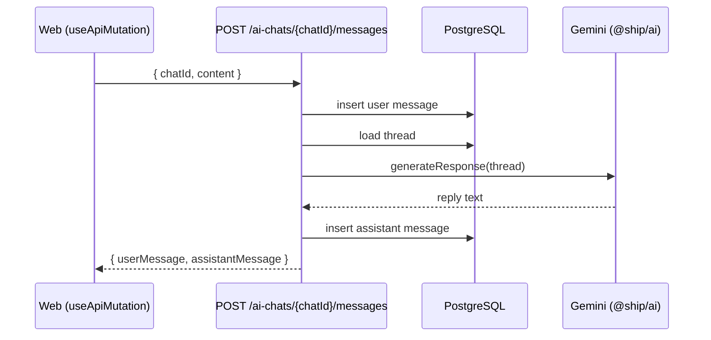

The `ai-chat` plugin adds a working AI chat to your app: multi-conversation history, per-user ownership, and Google Gemini responses through the [Vercel AI SDK](https://sdk.vercel.ai). Like every Ship plugin, it **merges into your codebase** — two resources on the API, a route tree on the web, and a tiny `@ship/ai` package you own and can edit.

## Requirements

- **PostgreSQL + TanStack Start** (full-stack). Chats and messages are stored with Drizzle in PostgreSQL.
- The **[Auth](/plugins/auth-starter)** plugin (`auth-starter`). Every endpoint runs behind `isAuthorized`, and the web pages live inside the authenticated app shell.

## Install

Pick `ai-chat` (and `auth-starter`) in the plugin multiselect when you scaffold:

```bash
npx @paralect/ship init
```

To run an existing project against the plugin sources in dev:

```bash
pnpm plugin:dev plugins/auth-starter plugins/ai-chat
```

Then add your Google AI key to the API `.env`:

```bash
GOOGLE_GENERATIVE_AI_API_KEY=your-google-ai-api-key
```

Get one at [Google AI Studio](https://aistudio.google.com/apikey).

## What merges in

```
apps/api/src/resources/ai-chats/
  ai-chats.schema.ts             # Drizzle table: ai_chats
  ai-messages.schema.ts          # Drizzle table: ai_messages
  endpoints/
    create.ts                    # POST   /ai-chats
    list.ts                      # GET    /ai-chats
    get-messages.ts              # GET    /ai-chats/{chatId}/messages
    send-message.ts              # POST   /ai-chats/{chatId}/messages
    remove.ts                    # DELETE /ai-chats/{chatId}
  middlewares/
    can-edit-chat.ts             # ownership gate (NOT_FOUND on mismatch)

apps/web/src/routes/_authenticated/app/ai-chat/
  index.tsx                      # new + active conversation
  $chatId.tsx                    # existing conversation
  -components/                   # chat box, message, input, skeleton

packages/ai/                     # @ship/ai — Gemini via the Vercel AI SDK
```

## Storage is PostgreSQL

Two tables, both built on `baseColumns` (a `uuid` id plus `createdAt` / `updatedAt` / `deletedAt`), so they get soft-delete for free. `ai_messages.chatId` cascades on delete.

```ts
// apps/api/src/resources/ai-chats/ai-chats.schema.ts
import { pgTable, text } from 'drizzle-orm/pg-core';

import { baseColumns } from '@/resources/base.schema';
import { users } from '@/resources/users/users.schema';

export const aiChats = pgTable('ai_chats', {
  ...baseColumns,
  title: text('title').notNull().default('New Chat'),
  userId: text('user_id')
    .notNull()
    .references(() => users.id),
});
```

```ts
// apps/api/src/resources/ai-chats/ai-messages.schema.ts
import { pgTable, text, uuid } from 'drizzle-orm/pg-core';

import { baseColumns } from '@/resources/base.schema';
import { aiChats } from './ai-chats.schema';

export const aiMessages = pgTable('ai_messages', {
  ...baseColumns,
  chatId: uuid('chat_id')
    .notNull()
    .references(() => aiChats.id, { onDelete: 'cascade' }),
  role: text('role', { enum: ['user', 'assistant'] }).notNull(),
  content: text('content').notNull(),
});
```

After the schema files merge in, regenerate the typed `DbService` and the migration:

```bash
pnpm --filter api codegen      # adds db.aiChats / db.aiMessages to @/db
pnpm --filter api generate     # drizzle-kit emits the SQL
pnpm --filter api migrate      # applies it
```

## The AI package

`@ship/ai` is a small package (`packages/ai`) wrapping the Vercel AI SDK. It exposes one function, `generateResponse`, which sends the conversation to Gemini (`gemini-2.5-flash`) and returns the final text. It reads `GOOGLE_GENERATIVE_AI_API_KEY` from the environment, and trims context to the last 50 messages.

```ts
// packages/ai/src/index.ts
import { generateResponse } from '@ship/ai';

const reply = await generateResponse([
  { role: 'user', content: 'Explain oRPC in one sentence.' },
]);
```

Swap the model — or wire up a different provider — with `configureAi`:

```ts
import { configureAi } from '@ship/ai';
import { createGoogleGenerativeAI } from '@ai-sdk/google';

const google = createGoogleGenerativeAI({ apiKey: process.env.GOOGLE_GENERATIVE_AI_API_KEY });
configureAi({ model: google('gemini-2.5-pro'), maxContextMessages: 30 });
```

## Endpoints are oRPC

Every endpoint builds on the shared `@/endpoint` builder, runs behind `isAuthorized`, and declares an explicit route. Reads and writes go through the typed `db.aiChats` / `db.aiMessages` services.

`send-message` is where it comes together: save the user message, load the full thread, ask Gemini, persist the reply, and auto-title the chat on the first turn.

```ts
// apps/api/src/resources/ai-chats/endpoints/send-message.ts
import db from '@/db';
import endpoint from '@/endpoint';
import isAuthorized from '@/middlewares/is-authorized';
import canEditChat from '@/resources/ai-chats/middlewares/can-edit-chat';
import { z } from 'zod';
import { generateResponse } from '@ship/ai';

const inputSchema = z.object({
  chatId: z.string(),
  content: z.string().min(1),
});

const messageSchema = z.object({
  id: z.string(),
  role: z.enum(['user', 'assistant']),
  content: z.string(),
});

const outputSchema = z.object({
  userMessage: messageSchema,
  assistantMessage: messageSchema,
});

export default endpoint
  .use(isAuthorized)
  .route({ method: 'POST', path: '/ai-chats/{chatId}/messages' })
  .input(inputSchema)
  .use(canEditChat)
  .output(outputSchema)
  .handler(async ({ context, input }) => {
    const userMessage = await db.aiMessages.insertOne({
      chatId: input.chatId,
      role: 'user',
      content: input.content,
    });

    const history = await db.aiMessages.find({
      where: { chatId: input.chatId, deletedAt: null },
      orderBy: { createdAt: 'asc' },
    });

    const responseText = await generateResponse(
      history.map((m) => ({ role: m.role as 'user' | 'assistant', content: m.content })),
    );

    const assistantMessage = await db.aiMessages.insertOne({
      chatId: input.chatId,
      role: 'assistant',
      content: responseText,
    });

    if (context.chat.title === 'New Chat') {
      const title = input.content.slice(0, 50) + (input.content.length > 50 ? '...' : '');
      await db.aiChats.updateOne({ id: input.chatId }, { title });
    }

    return {
      userMessage: { id: userMessage.id, role: 'user' as const, content: userMessage.content },
      assistantMessage: { id: assistantMessage.id, role: 'assistant' as const, content: assistantMessage.content },
    };
  });
```

The handler returns both messages in one response, so the client has the persisted ids and the assistant reply without a second round-trip.

After the endpoint files merge in, regenerate the router and contract:

```bash
pnpm --filter api codegen
```



### Ownership is a gate, not an `if`

The `canEditChat` middleware loads the requested chat for the current user into `context.chat` or throws `NOT_FOUND`. Because access and existence collapse into one error, an unauthorized user can't tell whether a chat exists.

```ts
// apps/api/src/resources/ai-chats/middlewares/can-edit-chat.ts
import db from '@/db';
import canEdit from '@/middlewares/can-edit';

// Loads the current user's chat into context.chat, or throws NOT_FOUND.
// Apply with .use(canEditChat) after .input().
export default canEdit('chat', db.aiChats, { message: 'Chat not found' });
```

`list` and `create` only need `isAuthorized`; `get-messages`, `send-message` and `remove` stack `canEditChat` on top. See [How Ship works](/how-ship-works) for the full gate model.

| Endpoint | Route | Gates |
| --- | --- | --- |
| `aiChats.create` | `POST /ai-chats` | `isAuthorized` |
| `aiChats.list` | `GET /ai-chats` | `isAuthorized` |
| `aiChats.getMessages` | `GET /ai-chats/{chatId}/messages` | `isAuthorized` + `canEditChat` |
| `aiChats.sendMessage` | `POST /ai-chats/{chatId}/messages` | `isAuthorized` + `canEditChat` |
| `aiChats.remove` | `DELETE /ai-chats/{chatId}` | `isAuthorized` + `canEditChat` |

Every route shows up live in the [Scalar API reference](/api-reference/overview) at `http://localhost:3001/docs`.

## The web side

The chat UI is a pair of [TanStack Router](https://tanstack.com/router) routes under the authenticated app shell:

- `/app/ai-chat` — start a new conversation
- `/app/ai-chat/$chatId` — an existing one

Both render the same `AiChatPage` component. It talks to the API through the typed oRPC client and the Auth plugin's `useApiMutation` hook — no hand-written fetch, fully typed end to end:

```tsx
// apps/web/src/routes/_authenticated/app/ai-chat/index.tsx
import { queryKey, useApiMutation, useQueryClient } from '@/hooks';
import { apiClient } from '@/services/api-client.service';

const sendMessage = useApiMutation(apiClient['ai-chats'].sendMessage, {
  onSuccess: (data) => {
    setMessages((prev) => [
      ...prev.filter((m) => !m.id.startsWith('temp-')),
      { id: data.userMessage.id, role: data.userMessage.role, content: data.userMessage.content },
      { id: data.assistantMessage.id, role: data.assistantMessage.role, content: data.assistantMessage.content },
    ]);
    queryClient.invalidateQueries({ queryKey: queryKey(apiClient['ai-chats'].list) });
  },
});
```

The page sends the message optimistically (a `temp-` placeholder), then swaps in the persisted user and assistant messages from the response. The presentational pieces — `AiChatBox`, `AiChatMessage`, `AiChatInput`, `AiMessageSkeleton` — live in the router-ignored `-components/` folder, so they're yours to restyle.

<Tip>
Everything that merges in is ordinary Ship code. Want streaming tokens, tool calls, or a different provider? It's `generateResponse` in `packages/ai` and one oRPC endpoint — edit them like any other resource.
</Tip>
