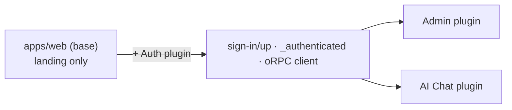

The **Auth** plugin (`auth-starter`) is how a Ship project gets authentication. It's the bridge between your web app and the API: selecting it adds the better-auth backend, the sign-in / sign-up / password-reset pages, the authenticated app shell, and the typed oRPC client the rest of your UI builds on. Skip it and your project ships a clean landing page with nothing to sign into.

<Info>Requires **PostgreSQL** (and pulls in [Mailer](/mailer) for verification/reset emails and Cloud Storage for avatar uploads).</Info>

## What it adds

**API**
- [better-auth](https://better-auth.com/) configured for email/password (with verification + reset) and Google OAuth.
- `users` / `accounts` / `sessions` / `verifications` schemas and the auth route handler.

**Web** (merged into `apps/web`)
- routes: `sign-in`, `sign-up`, `forgot-password`, `reset-password`, the `_authenticated` guard and settings.
- the oRPC client (`services/api-client.service.ts`) and the `useApiQuery` / `useApiMutation` / `useApiForm` / `useCurrentUser` hooks.

## Why auth is a plugin

In 3.0.0 the base `apps/web` is just a landing page with **no dependency on the API**. Auth — and the oRPC client that talks to the API — lives in this plugin so that:

- **web-only** projects stay clean (no auth, no API client, no backend coupling),
- **full-stack** projects opt in, and
- any plugin with authenticated routes ([Admin](/plugins/admin), [AI Chat](/plugins/ai-chat)) builds on the `_authenticated` shell and hooks it provides.



## Using it

The `_authenticated` guard redirects signed-out users to `/sign-in`; inside it, `useCurrentUser()` reads the session and the typed `apiClient` calls the API. See [Calling the API](/web/calling-api) for the client and hooks.


## Grant admin

Auth ships a CLI to flip a user's admin flag:

```bash
pnpm --filter api admin:set -- user@example.com
```

Pair it with the [Admin](/plugins/admin) plugin to get a user-management dashboard.
