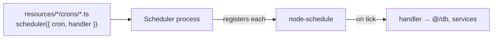

Ship runs scheduled work as part of the API. A cron job is **one file** that pairs a cron expression with a handler, defined with the `scheduler({ cron, handler })` factory and auto-discovered from any resource's `crons/` folder — so a plugin adds scheduled work exactly the way it adds an endpoint.

## Define a cron job

```ts
// apps/api/src/resources/invite-tokens/crons/cleanup-expired.ts
import scheduler from '@/scheduler';
import db from '@/db';

export default scheduler({
  cron: '0 * * * *', // every hour, on the hour
  handler: async () => {
    await db.inviteTokens.deleteMany({ where: { expiresAt: { lte: new Date() } } });
  },
});
```

The schedule and the work live together — no separate cron registry, no event names to keep in sync. The handler runs in the API context, so it has full access to `@/db`, services, and everything else.

## Where cron files live

Cron files are owned by the resource they belong to:

```
resources/invite-tokens/
  invite-tokens.schema.ts
  endpoints/
  crons/
    cleanup-expired.ts      # ← auto-registered
```

Every `**/crons/*.ts` default export is collected when the scheduler process starts and registered with [node-schedule](https://www.npmjs.com/package/node-schedule) — the same filesystem-driven wiring as [endpoints](/api-reference/routing/overview). There is no central list to edit.



## Add a cron from a plugin

Because discovery is by file path, a plugin just ships a `crons/` file in one of its resources:

```ts
// plugins/billing/api/resources/subscriptions/crons/sync-invoices.ts
import scheduler from '@/scheduler';
import { syncInvoices } from '../methods/sync-invoices';

export default scheduler({
  cron: '*/15 * * * *', // every 15 minutes
  handler: syncInvoices,
});
```

When the plugin merges into a project, its cron files are picked up automatically — no scheduler wiring to touch.

## Run the scheduler

```bash
pnpm --filter api schedule       # production
pnpm --filter api schedule-dev   # local, watch mode
```

`pnpm start` runs the scheduler alongside the API and web app. In production it runs as its own process from the API image (`apps/api/Dockerfile.scheduler`), started **after** the [Migrator](/migrator) so it always works against an up-to-date schema — see [deployment](/deployment/digital-ocean-apps).

## Cron format

The `cron` field is a standard five-field cron expression:


| Expression | Runs |
| --- | --- |
| `* * * * *` | every minute |
| `*/15 * * * *` | every 15 minutes |
| `0 * * * *` | every hour |
| `0 0 * * *` | every day at midnight |
| `0 9 * * 1` | every Monday at 09:00 |

<Tip>Keep handlers idempotent and quick, and always let errors surface to the logger. For long or heavy work, have the cron enqueue it or emit a [mutation event](/api-reference/using-events) and do the work elsewhere.</Tip>
